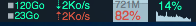

# MacMeters

Status bar indicators to monitor your Mac.

I was using the wonderful MenuMeters by Alex Harper, but it has been broken by the new OSX El Capitan. So I choose to create my own status bar icons to monitor my computer.

Please note that the project is at an early stage, a lot of things remain to be done.

Actually the colors of the indicators are suited for the Apple Dark theme, but you are now able to customize the colors in the settings window!

